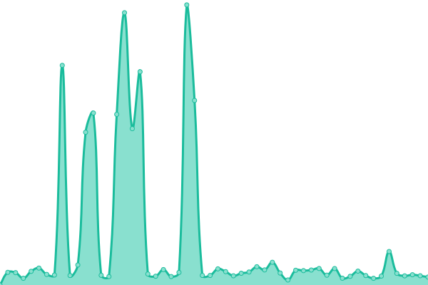

# [📈 Live Status](https://schollz.github.io/upptime): <!--live status--> **🟩 All systems operational**

This repository contains the open-source uptime monitor and status page for [Zack](https://schollz.com), powered by [Upptime](https://github.com/upptime/upptime).

With [Upptime](https://upptime.js.org), you can get your own unlimited and free uptime monitor and status page, powered entirely by a GitHub repository. We use [Issues](https://github.com/schollz/upptime/issues) as incident reports, [Actions](https://github.com/schollz/upptime/actions) as uptime monitors, and [Pages](https://schollz.github.io/upptime) for the status page.

<!--start: status pages-->
<!-- This summary is generated by Upptime (https://github.com/upptime/upptime) -->
<!-- Do not edit this manually, your changes will be overwritten -->
<!-- prettier-ignore -->
| URL | Status | History | Response Time | Uptime |
| --- | ------ | ------- | ------------- | ------ |
|  [getcroc](https://getcroc.schollz.com/) | 🟩 Up | [getcroc.yml](https://github.com/schollz/upptime/commits/HEAD/history/getcroc.yml) | 

 233ms
     
 | 

<a href="https://schollz.github.io/upptime/history/getcroc">100.00%</a>
    

|  [findabooktoread.com](https://findabooktoread.com/) | 🟩 Up | [findabooktoread-com.yml](https://github.com/schollz/upptime/commits/HEAD/history/findabooktoread-com.yml) | 

 76ms
     
 | 

<a href="https://schollz.github.io/upptime/history/findabooktoread-com">100.00%</a>
    

|  [pianos.pub](https://pianos.pub/) | 🟩 Up | [pianos-pub.yml](https://github.com/schollz/upptime/commits/HEAD/history/pianos-pub.yml) | 

 141ms
     
 | 

<a href="https://schollz.github.io/upptime/history/pianos-pub">100.00%</a>
    

|  [schollz.com](https://schollz.com/) | 🟩 Up | [schollz-com.yml](https://github.com/schollz/upptime/commits/HEAD/history/schollz-com.yml) | 

 51ms
     
 | 

<a href="https://schollz.github.io/upptime/history/schollz-com">100.00%</a>
    

|  [teoperator.com](https://teoperator.com/) | 🟩 Up | [teoperator-com.yml](https://github.com/schollz/upptime/commits/HEAD/history/teoperator-com.yml) | 

 111ms
     
 | 

<a href="https://schollz.github.io/upptime/history/teoperator-com">100.00%</a>
    

|  [poetrygenerator](https://www.poetrygenerator.ninja/) | 🟩 Up | [poetrygenerator.yml](https://github.com/schollz/upptime/commits/HEAD/history/poetrygenerator.yml) | 

 306ms
     
 | 

<a href="https://schollz.github.io/upptime/history/poetrygenerator">100.00%</a>
    

|  [whowillmatch](https://whowillmatchmydonation.com/) | 🟩 Up | [whowillmatch.yml](https://github.com/schollz/upptime/commits/HEAD/history/whowillmatch.yml) | 

 46ms
     
 | 

<a href="https://schollz.github.io/upptime/history/whowillmatch">100.00%</a>
    

<!--end: status pages-->

[**Visit our status website →**](https://schollz.github.io/upptime)

## 📄 License

- Powered by: [Upptime](https://github.com/upptime/upptime)
- Code: [MIT](./LICENSE) © [Zack](https://schollz.com)
- Data in the `./history` directory: [Open Database License](https://opendatacommons.org/licenses/odbl/1-0/)
