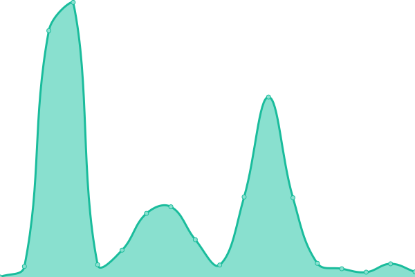
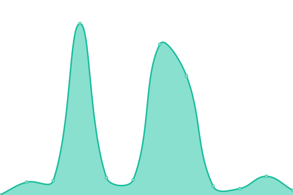
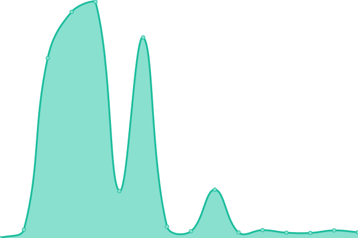
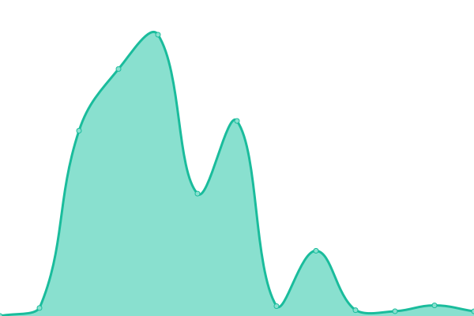

# [📈 Live Status](https://schollz.github.io/upptime): <!--live status--> **🟧 Partial outage**

This repository contains the open-source uptime monitor and status page for [Zack](https://schollz.com), powered by [Upptime](https://github.com/upptime/upptime).

With [Upptime](https://upptime.js.org), you can get your own unlimited and free uptime monitor and status page, powered entirely by a GitHub repository. We use [Issues](https://github.com/schollz/upptime/issues) as incident reports, [Actions](https://github.com/schollz/upptime/actions) as uptime monitors, and [Pages](https://schollz.github.io/upptime) for the status page.

<!--start: status pages-->
<!-- This summary is generated by Upptime (https://github.com/upptime/upptime) -->
<!-- Do not edit this manually, your changes will be overwritten -->
<!-- prettier-ignore -->
| URL | Status | History | Response Time | Uptime |
| --- | ------ | ------- | ------------- | ------ |
|  [getcroc.schollz.com](https://getcroc.schollz.com/) | 🟩 Up | [getcroc-schollz-com.yml](https://github.com/schollz/upptime/commits/HEAD/history/getcroc-schollz-com.yml) | 

 281ms
     
 | 

<a href="https://schollz.github.io/upptime/history/getcroc-schollz-com">99.27%</a>
    

|  [findabooktoread.com](https://findabooktoread.com/) | 🟩 Up | [findabooktoread-com.yml](https://github.com/schollz/upptime/commits/HEAD/history/findabooktoread-com.yml) | 

 283ms
     
 | 

<a href="https://schollz.github.io/upptime/history/findabooktoread-com">99.27%</a>
    

|  [pianos.pub](https://pianos.pub/) | 🟩 Up | [pianos-pub.yml](https://github.com/schollz/upptime/commits/HEAD/history/pianos-pub.yml) | 

 422ms
     
 | 

<a href="https://schollz.github.io/upptime/history/pianos-pub">99.27%</a>
    

|  [schollz.com](https://schollz.com/) | 🟩 Up | [schollz-com.yml](https://github.com/schollz/upptime/commits/HEAD/history/schollz-com.yml) | 

 270ms
     
 | 

<a href="https://schollz.github.io/upptime/history/schollz-com">99.27%</a>
    

|  [teoperator.com](https://teoperator.com/) | 🟩 Up | [teoperator-com.yml](https://github.com/schollz/upptime/commits/HEAD/history/teoperator-com.yml) | 

 334ms
     
 | 

<a href="https://schollz.github.io/upptime/history/teoperator-com">100.00%</a>
    

|  [www.poetrygenerator.ninja](https://www.poetrygenerator.ninja/) | 🟥 Down | [www-poetrygenerator-ninja.yml](https://github.com/schollz/upptime/commits/HEAD/history/www-poetrygenerator-ninja.yml) | 

 0ms
     
 | 

<a href="https://schollz.github.io/upptime/history/www-poetrygenerator-ninja">0.00%</a>
    

|  [norns.online](https://norns.online/) | 🟩 Up | [norns-online.yml](https://github.com/schollz/upptime/commits/HEAD/history/norns-online.yml) | 

 276ms
     
 | 

<a href="https://schollz.github.io/upptime/history/norns-online">100.00%</a>
    

|  [averagedrecipe](https://averagedrecipe.com/) | 🟩 Up | [averagedrecipe.yml](https://github.com/schollz/upptime/commits/HEAD/history/averagedrecipe.yml) | 

 478ms
     
 | 

<a href="https://schollz.github.io/upptime/history/averagedrecipe">100.00%</a>
    

|  [cowyo](https://cowyo.com/) | 🟩 Up | [cowyo.yml](https://github.com/schollz/upptime/commits/HEAD/history/cowyo.yml) | 

 452ms
     
 | 

<a href="https://schollz.github.io/upptime/history/cowyo">100.00%</a>
    

|  [nyblcore](https://api.nyblcore.com/) | 🟩 Up | [nyblcore.yml](https://github.com/schollz/upptime/commits/HEAD/history/nyblcore.yml) | 

 293ms
     
 | 

<a href="https://schollz.github.io/upptime/history/nyblcore">100.00%</a>
    

|  [pikocore](https://api.pikocore.com/) | 🟩 Up | [pikocore.yml](https://github.com/schollz/upptime/commits/HEAD/history/pikocore.yml) | 

 305ms
     
 | 

<a href="https://schollz.github.io/upptime/history/pikocore">99.27%</a>
    

|  [streammyaudio](https://streammyaudio.com/) | 🟩 Up | [streammyaudio.yml](https://github.com/schollz/upptime/commits/HEAD/history/streammyaudio.yml) | 

 347ms
     
 | 

<a href="https://schollz.github.io/upptime/history/streammyaudio">100.00%</a>
    

<!--end: status pages-->

[**Visit our status website →**](https://schollz.github.io/upptime)

## 📄 License

- Powered by: [Upptime](https://github.com/upptime/upptime)
- Code: [MIT](./LICENSE) © [Zack](https://schollz.com)
- Data in the `./history` directory: [Open Database License](https://opendatacommons.org/licenses/odbl/1-0/)
